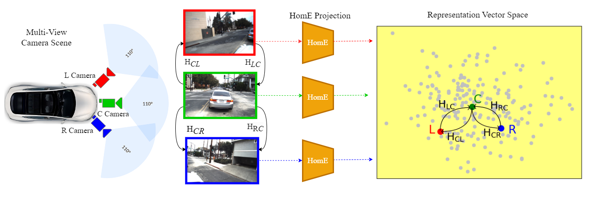

# HomE: Homography-Equivariant Video Representation Learning

Recent advances in self-supervised representation learning have enabled more efficient and robust model performance without relying on extensive labeled data. However, most works are still focused on images, with few working on videos and even fewer on multi-view videos, where more powerful inductive biases can be leveraged for self-supervision. In this work, we propose a novel method for representation learning of multi-view videos, where we explicitly model the representation space to maintain Homography Equivariance (HomE). Our method learns an implicit mapping between different views, culminating in a representation
space that maintains the homography relationship between neighboring views. We
evaluate our HomE representation via action recognition and pedestrian intent
prediction as downstream tasks. On action classification, our method obtains
96.4% 3-fold accuracy on the UCF101 dataset, better than most state-of-the-art
self-supervised learning methods. Similarly, on the STIP dataset, we outperform
the state-of-the-art by 6% for pedestrian intent prediction one second into the
future while also obtaining an accuracy of 91.2% for pedestrian action (cross vs.
not-cross) classification

   

## Key Contributions
Our contributions in this paper are threefold. First, we propose a simple and efficient representation learning technique that learns a vector space preserving the spatial structure between input views and
learned representations. Unlike other multi-view representation learning methods, we do not align
the representations of different views, we rather learn representations that are related to one another
through their Homography matrices. Second, we also develop a neural network model consisting
of an encoder, vector neuron layers, and a decoder network to assist the learning. Third, we
improve the performance on pedestrian intent prediction on the STIP dataset. We further validate our
algorithm for action classification on the UCF-101 dataset and image classification on the synthetic
CIFAR-10 dataset, achieving SOTA.

## People

This work has been developed by [Anirudh Sriram](https://github.com/anirudhs123), Prof.Ehsan Adeli, Prof.Jiajun Wu, Prof.Juan Carlos Niebles and Prof.Fei-Fei Li from Stanford University along with Dr. Adrien Gaidon from Toyota Research Institute (TRI).

